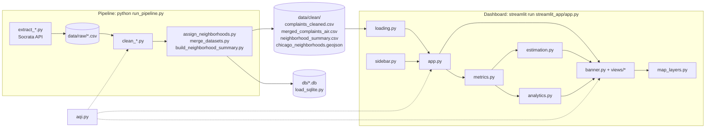

# Architecture

How the code behind the dashboard fits together. This covers the code, not the app's UI. For a guided trace of one user action through the code, read [LIFE_OF_A_RERUN.md](LIFE_OF_A_RERUN.md); for step-by-step extension recipes, read [HOW_TO.md](HOW_TO.md); for a runnable tour with real data, open [notebooks/architecture_tour.ipynb](../notebooks/architecture_tour.ipynb).

## The big picture

Two programs share one folder of files. The **pipeline** turns public data into clean CSVs; the **dashboard** only reads those CSVs. They never call each other, and the only code they both import is [aqi.py](../aqi.py).



Things the diagram implies that are easy to miss:

- The dashboard does **not** read the SQLite database or the optional EPA files. Only the four `data/clean` files above.
- Raw API pulls are cached for 24 hours in `data/raw/`; `python run_pipeline.py --skip-api` re-runs only the cleaning steps.
- `aqi.py` has no Streamlit imports so the pipeline can use it too.

## Module map (dashboard)

Every file starts with a four-line docstring: **Purpose / Inputs / Outputs / Used by**. Read those first.

| Module | One-line job | Reads | Produces |
|---|---|---|---|
| [app.py](../streamlit_app/app.py) | Entry point. A straight line: load, sidebar, filter and aggregate, render. | everything below | the page |
| [loading.py](../streamlit_app/loading.py) | Read the four `data/clean` files and validate their columns. | CSVs, GeoJSON | `PipelineData` |
| [sidebar.py](../streamlit_app/sidebar.py) | Draw every filter widget. | date bounds, neighborhood names | `SidebarState` |
| [metrics.py](../streamlit_app/metrics.py) | Filter by date/neighborhood; aggregate to city, sensor and neighborhood level. | `PipelineData` frames | small frames |
| [estimation.py](../streamlit_app/estimation.py) | Fill neighborhoods without sensors using inverse-distance weighting (IDW). | neighborhood metrics, sensors, GeoJSON | map-ready metrics + `coverage_source` |
| [analytics.py](../streamlit_app/analytics.py) | Lead-lag correlation and spike analysis. | city-daily frame | correlation / concordance frames |
| [banner.py](../streamlit_app/banner.py) | AQI hero banner, four KPI cards, window caption. | current + prior period frames | Streamlit elements |
| [map_layers.py](../streamlit_app/map_layers.py) | Boundaries, sensor markers, complaint points on a map figure. | figure + frames | modifies the figure |
| [views/](../streamlit_app/views) | One file per tab (`map_tab`, `trends_tab`, `neighborhood_tab`, `lag_tab`, `quality_tab`). | `SidebarState` + frames | Streamlit elements |
| [constants.py](../streamlit_app/constants.py) | Labels, `MAP_METRICS`, `POLLUTANTS`, map center/zoom. | none | constants |
| [theme.py](../streamlit_app/theme.py) | Two palettes (Terminal, Accessible), figure styling, chrome CSS. | theme name | theme dict |
| [dashboard_data.py](../streamlit_app/dashboard_data.py) | Re-exports the data layer so older imports keep working. | n/a | n/a |

### Layering rule

Dependencies point one way, so you can read bottom-up without cycles:

```
aqi.py  <-  loading / metrics / estimation / analytics   (pure pandas, no Streamlit)
                          ^
        constants / theme / map_layers                   (Plotly helpers, no data loading)
                          ^
              sidebar / banner / views/*                 (Streamlit UI)
                          ^
                        app.py                           (wiring)
```

The data layer (`loading`, `metrics`, `estimation`, `analytics`) never imports Streamlit. That is what makes it testable with tiny synthetic DataFrames and usable from a notebook.

## Core data shapes

| Name | One row is | Key columns |
|---|---|---|
| `merged` | one sensor on one day | `sensor_name`, `date`, `pm25_mean`, `no2_mean`, `lat`, `lon`, `complaint_count`, `pm25_spike`, `neighborhood` |
| `complaints` | one 311 complaint | `complaint_id`, `date`, `latitude`, `longitude`, `neighborhood`, `nearest_sensor` |
| `summary` | one neighborhood (all-time) | `neighborhood`, `sensor_count`, `has_sensor_coverage`, `total_complaints` |
| `city_daily` | one calendar day, citywide | `date`, `pm25_mean`, `no2_mean`, `complaint_count`, `spike_sensor_days` |
| `sensors` (snapshot) | one sensor, selected window | `lat`, `lon`, `pm25_mean`, `total_complaints`, `active_days`, `pm25_aqi` |
| `map_metrics` | one neighborhood, selected window | `*_period` (direct), `*_estimated` (IDW), `*_map_value` (what the map shows), `coverage_source` |

`map_metrics` is the one to understand. For each neighborhood, `*_map_value` is the direct sensor average when one exists, otherwise the IDW estimate. `coverage_source` records which: `direct`, `estimated_idw` or `unavailable`.

## Glossary

- **Sensor-day**: one Open Air Chicago sensor's daily average. The unit of `merged`.
- **Spike**: in the pipeline, `pm25_spike` flags a sensor-day above 35 µg/m³ (the EPA 24-hour standard). The dashboard's Lead-Lag tab instead calls a *city-level* day a spike when it is in the top N% of the selected window (the sidebar percentile).
- **Lead-lag**: correlation of PM2.5 on day *t* with complaints on day *t + lag*. A positive lag means complaints trail pollution.
- **Concordance**: mean complaints at offsets -2..+2 days around spike days, compared with a non-spike baseline.
- **IDW**: inverse-distance weighting. A missing value is the average of the *k* nearest sensors, each weighted by `1 / distance^power`.
- **AQI**: EPA Air Quality Index from the 2024 PM2.5 breakpoints, computed in `aqi.py`. NO2 is in **ppb** throughout; its AQI helper is informational only.

## Design decisions worth knowing

- **One bootstrap, plain imports.** `streamlit run` only puts the script's own folder on `sys.path`. `app.py` adds the repo root once, near the top, so every other module uses ordinary `from streamlit_app.x import y` and `from aqi import z`. A test starts a clean process to guard this, because pytest's own path settings would hide a break.
- **AQI lives in one place.** Breakpoints, colors, categories, the colorscale and the CSS gradient are all derived from `AQI_CATEGORIES` in `aqi.py`.
- **`dashboard_data.py` is a facade.** It re-exports the data layer so tests and notebooks that import from it keep working. New code should import from the specific module.
- **`SidebarState` instead of 20 loose variables.** The sidebar returns one frozen object; views read `ui.theme`, `ui.map_mode`, and so on.
- **Views receive data; they do not fetch it.** A tab function takes already-filtered frames. That keeps `app.py` the only place that knows the order of operations.

## Testing and refactoring safely

| Layer | Where | What it proves |
|---|---|---|
| Data-layer unit tests | `tests/test_dashboard_data.py` | Filters, aggregations, lag/spike maths, AQI, and IDW checked against an independent formula. |
| App smoke test | `tests/test_app_smoke.py` | The real `app.py` runs headlessly on synthetic data across both themes, all map metrics and both map modes without raising. |
| Import-path test | same file | `app.py` imports resolve when only its own folder is on `sys.path`. |
| Pipeline tests | `tests/test_*.py` for scripts | Cleaning and spatial-assignment logic. |

Unit tests do not run `run_pipeline.py` end to end. After changing anything under `scripts/`, run `python run_pipeline.py --skip-api` as well.

When restructuring the dashboard, the strongest check is a before/after snapshot: drive the app through `streamlit.testing.v1.AppTest` across widget combinations, save every rendered Plotly spec, metric, markdown block and table, and compare byte for byte. Deliberately break one chart title once to prove the comparison can fail.
